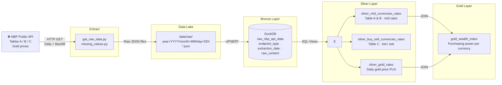

# 📊 NBP API Data Pipeline

> **Automated ETL pipeline** for financial data from the National Bank of Poland (NBP) — built with a production-grade **Medallion Architecture** (Bronze → Silver → Gold) on top of DuckDB and GitHub Actions.


---

## 🎯 Why This Project?

Financial data from the NBP API is publicly available but unstructured and ephemeral — there's no historical store, no clean schema, and no analytics layer. This project solves that by building a **self-healing, fully automated pipeline** that:

- **Collects** daily FX rates (Tables A, B, C) and gold prices
- **Detects and backfills** any gaps in historical data automatically
- **Transforms** raw JSON into clean, query-ready analytical views
- **Runs hands-free** every day via GitHub Actions with zero manual intervention

---

## 🏗️ Architecture



---

## ✅ Silver Layer — Output Schema

Three structured views, automatically created on every pipeline run:

| View | Source | Key columns |
|------|--------|-------------|
| `silver_mid_currencies_rates` | Tables A & B | `code`, `currency`, `effective_date`, `mid` |
| `silver_buy_sell_currencies_rates` | Table C | `code`, `currency`, `effective_date`, `bid`, `ask`, `final_rate` |
| `silver_gold_rates` | Gold endpoint | `effective_date`, `price` (PLN/g) |

The Gold layer view `gold_wealth_index` joins currencies with gold prices to expose **purchasing-power metrics per currency** (`purchase_idx_per_currency`, `cost_of_one_gram_per_currency`).

---

## 🚀 Features

- **Reactive Backfill**: On startup, the pipeline detects missing dates in the data lake and re-fetches them before the daily load runs.
- **Idempotent Loads**: UPSERT logic (`ON CONFLICT DO NOTHING`) means the pipeline can be re-run safely at any time.
- **Config-Driven**: All API endpoints, file paths, and SQL directories are managed via a single `config.yaml` — no hardcoded values.
- **Structured Logging**: Timezone-aware (Europe/Warsaw), module-scoped loggers with consistent formatting across all pipeline stages.
- **SQL-First Silver Layer**: Transformations are plain SQL files — easy to version, review, and extend without touching Python.

---

## 🛠️ Tech Stack

| Area | Technology |
|------|-----------|
| Language | Python 3.12+ |
| Database | DuckDB (embedded, persistent) |
| Transformation | SQL (DDL views) |
| Automation | GitHub Actions |
| Config | YAML |
| Libraries | `requests`, `pathlib`, `duckdb`, `pyyaml` |

---

## 🏗 Project Structure

```text
├── etl/
│   ├── extract/         # API extraction logic (daily + backfill)
│   │   ├── get_raw_data.py
│   │   └── missing_values.py
│   └── transform/       # Bronze & Silver layer loaders
│       ├── raw_to_bronze.py
│       └── bronze_to_silver.py
├── src/
│   └── utils/           # DB setup, logging, config loader
├── data/
│   ├── raw/             # Partitioned JSON data lake (year/month/day)
│   ├── db/              # Persistent DuckDB file
│   └── sql_files/
│       ├── ddl/         # Silver & Gold view definitions
│       └── dml/         # DML scripts
├── .github/workflows/   # Daily CI/CD automation
├── logs/                # Execution logs
├── main.py              # Pipeline entrypoint
└── config.yaml          # Centralized configuration
```

---

## ⚙️ Setup & Usage

1. **Clone the repository**:
   ```bash
   git clone https://github.com/przemsu/nbp_api.git
   cd nbp_api
   ```

2. **Install dependencies**:
   ```bash
   pip install -r requirements.txt
   ```

3. **Run the pipeline**:
   ```bash
   python -m main
   ```

The pipeline will automatically detect missing dates, fetch any gaps, load raw data into Bronze, and build all Silver views in a single run.

---

## 📈 Development Roadmap

- [x] **Sprint 1: Foundations** — Logging, Config, Basic Extraction
- [x] **Sprint 2: Bronze Layer** — DuckDB Integration, Incremental Loading, UPSERT
- [x] **Sprint 3: Silver Layer** — Structured DuckDB views (mid rates, buy/sell, gold)
- [ ] **Sprint 4: Gold Layer** — Full analytics layer, Purchasing Power Index (`gold_wealth_index` started)
- [ ] **Sprint 5: API Distribution** — FastAPI REST layer on top of the Gold layer

---

## 🛡️ Engineering Decisions

| Decision | Rationale |
|----------|-----------|
| **DuckDB over PostgreSQL** | Zero-infrastructure setup; analytical query performance without a server |
| **SQL views for Silver layer** | Keeps transformations versionable, readable, and decoupled from Python code |
| **Partitioned data lake** | `year=/month=/day=` layout enables future Hive-style partition pruning |
| **UPSERT on Bronze** | Guarantees idempotency — safe to re-run after failures or config changes |
| **Reactive backfill on startup** | Self-healing pipeline; no manual intervention needed after outages |


